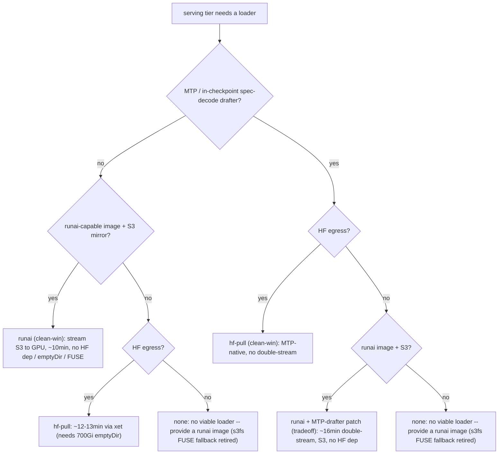

Status: Active
Audience: operators standing up inference (vLLM) deploys that load 100s-of-GB of weights.

# Fast model loading for inference (never settle for slow loads)

The inference-side companion to [`local-nvme-staging-rollout.md`](local-nvme-staging-rollout.md)
(which covers MLPerf-training dataset staging). Same root cause, same fix: do not
read a large model single-stream through s3fs FUSE.

## The problem

GLM-5.1 NVFP4 (433.9 GB, 49 shards) loaded **single-stream through s3fs FUSE
at ~58 MB/s = ~50 min cold, EVERY launch**. That destroys iteration speed and
is forbidden as a default.

## The rule (preference order, gate each)

Enforced by the always-applied `docs/METHODOLOGY.md`. Always pick
the fastest AVAILABLE loader. FLAG a slow load loudly and switch if effective rate
is `< ~500 MB/s` on a large model.

1. **Accelerated object-store endpoint** - a drop-in accelerated endpoint in
   front of the S3-compatible store, if your provider offers one. GATE: probe
   reachability AND a real bucket read. Two failure shapes seen in practice:
   an endpoint DNS name that resolves to a non-routable placeholder (the probe
   must fall back to the plain endpoint), and an endpoint that is TCP-reachable
   but does not serve the bucket (staging fails mid-flight. Drop it from the
   candidate list). Set `S3_ENDPOINT_URL` to force a known-good endpoint and
   skip the probe (plain endpoint validated at ~543 MB/s with the parallel stager).
2. **Parallel multipart -> local NVMe** then load local. GATE: node NVMe free
   `>= model_size x 1.2` (GB300 `/tmp` / emptyDir, xfs ~28 TiB. Probe with
   [`local-nvme-probe.sh`](../tools/local-nvme-probe.sh)).
3. **`runai_model_streamer`** (`--load-format runai_streamer`) - vLLM-native
   single-pass parallel S3 stream. GATE: package in the image (`vllm-tensorizer` has it).
4. **tensorizer** (`--load-format tensorizer`) - fastest cold-load for a pre-serialized
   model. GATE: a tensorized artifact exists.
5. **NEVER** plain single-stream s3fs FUSE for 100s-of-GB.

## The tool

[`tools/stage-model-parallel.py`](../tools/stage-model-parallel.py) implements path 2:
boto3 parallel multipart (N concurrent objects x M-way multipart) with an
accelerated-endpoint auto-probe and virtual-hosted-style addressing. Wire it into
a deploy as a pre-serve step, then `vllm serve` the local dir:

```bash
# vllm container, with an envFrom secret supplying the object-store creds
python3 stage-model-parallel.py s3://perf-lake/<model-prefix> /models/glm51
vllm serve /models/glm51 --quantization modelopt_fp4 --tensor-parallel-size 4 ...
```

Tunables (env): `STAGE_SHARD_CONCURRENCY` (default 16), `STAGE_MULTIPART_CONCURRENCY`
(default 8), `STAGE_CHUNK_MB` (default 256), `S3_ENDPOINT_URL` (skip the auto-probe).

## Gotcha

The object store requires **virtual-hosted-style** addressing (`bucket.host/key`). boto3
defaults to path-style for a custom `endpoint_url`. The store rejects it on `ListObjectsV2`
with `PathStyleRequestNotAllowed`. The stager sets `Config(s3={"addressing_style": "virtual"})`.

## Validation

On a GB300 node, staging GLM-5.1 (433.9 GB) with
16 shards x 8-way multipart measured **~544-600 MB/s aggregate (~10x the
~58 MB/s single-stream s3fs rate)**. No accelerated endpoint was reachable from
that zone, so the win is purely from parallelism over the plain endpoint. An
in-zone accelerated endpoint would raise it further.

## Loader selection for a serving tier (the resolver)

The ladder above ranks loaders by THROUGHPUT. Picking the loader for a specific serving TIER
also depends on the tier's spec-decode config and the cluster's egress/provenance constraints.
[`tools/loader_advisor.py`](../tools/loader_advisor.py) is the **single source of truth** for that
per-tier decision -- used by the `inference-model-optimize` advisor step, so the
advice and the rendered manifest never drift.



Measured basis (GLM-5.1-NVFP4, GB300 TP4): hf-pull+xet ~12-13min,
RunAI streamer ~10min (streams the object store at ~2 GB/s). RunAI + MTP needs
an MTP-drafter patch and then double-streams (~16min). boto3 parallel-multipart
(~0.5 GB/s, the stager above) is dominated by RunAI for streaming, but remains
the path when the image lacks runai_model_streamer.
s3fs FUSE is RETIRED as a fallback (it measured ~50min single-stream -- ~4x slower
than hf-pull): the no-HF-egress + no-runai-image case now resolves to `none`
instead of the slow s3fs fallback.

Inputs (knowable, not guessed): `mtp` (from `--speculative-config`), `hf_egress_ok` (operator/cluster),
`image_has_runai` (the `vllm-tensorizer` images carry it), `s3_available` (S3 mirror + creds). Run:

```bash
python3 tools/loader_advisor.py --serve-args "<vllm serve args>" \
  --hf-egress yes|no --image-has-runai yes|no --s3 yes|no [--emit <bundle-dir>]
# prints the recommendation + gates + rationale; --emit also writes loader_advisor.json + LOADER.md;
# --print-fragment prints only the deploy fragment key (baseline | baseline-runai).
```
