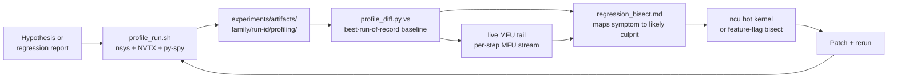

Status: Active
Audience: operators and reviewers who need to find Megatron / TransformerEngine / Megatron-Bridge inefficiencies on their own (rather than waiting for an upstream fix to land).

# Profiling and performance discovery

## Why this document exists

NVIDIA has been landing a steady stream of inefficiency fixes in
`Megatron-LM`, `Megatron-Bridge`, and `TransformerEngine` that downstream
users benefit from passively. The clearest single signal is TransformerEngine
commit `f2ed86bb` ("Ordering enforcement to
split_overlap_rs gemms (#2056)") which explicitly cites CUDA-graph capture
as the failure mode and adds a delay kernel to serialize GEMMs - that is an
Nsight-Systems-discovered race. The goal is to find that class of
issue yourself, on your own cluster, without waiting on the upstream
release cadence.

This doc is the cross-runbook strategy for that discovery process. The
per-target operator SOPs (B200 8B, GB300 405B, DSv3 671B regression
profiling) belong under [`runbooks/`](/plugins/profile-and-optimize/server/runbooks).

The symptom-to-culprit decision tree lives in
[`tools/pipeline/submission/profile/regression_bisect.md`](/plugins/profile-and-optimize/server/tools/pipeline/submission/profile/regression_bisect.md).

## What NVIDIA almost certainly does

Recent upstream fixes fall into four buckets that each suggest a discovery
technique. Two of them rely on tools most operators already have access to,
the other two are practices most teams already follow, but inconsistently.

### 1. Nsight Systems + NVTX timelines (GPU-side, multi-stream)

CUDA-graph + comm-overlap fixes are the kind of bug you only see by
inspecting the GPU+stream timeline against a known-good reference -
missing kernels, reordered launches, extra device-host syncs, or NCCL
collectives that no longer overlap with their compute. Recent examples:

- TE `f2ed86bb` - ordering enforcement on
  `split_overlap_rs` GEMMs (delay kernel inserted to fix capture race).
- TE `077e26c3` - userbuffers for MXFP8 wgrad
  all-gather overlap.
- Megatron-LM `546a448b4bf0` and
  `2be925cabe69` - CUDA-graph "M4 leftover" fills.
- Bridge `6a56e1519c79` - TE CUDA-graph cleanup
  through the right API.

All three repos already plumb NVTX:

- `Megatron-LM/megatron/core/utils.py`
  exposes `configure_nvtx_profiling`, `nvtx_range_push`,
  `nvtx_range_pop`, and `nvtx_decorator`.
- `Megatron-LM/megatron/training/training.py`
  wires `--profile`, `--profile_step_start`, `--profile_step_end`,
  `--profile_ranks`, `--nvtx_ranges`, `--use-pytorch-profiler`, and
  `emit_nvtx` for nsys.
- `TransformerEngine/transformer_engine/pytorch/utils.py`
  exposes `get_nvtx_range_context`, `nvtx_range_push`, `nvtx_range_pop`,
  with fine-grained NVTX spans inside the core modules
  (`linear.py`, `layernorm_linear.py`, attention paths).
- `Megatron-Bridge/src/megatron/bridge/training/profiling.py`
  reuses Megatron-LM's `ProfilingConfig`.

The gap is not instrumentation, it is the **driver**: a
Slurm-aware launcher that turns those flags on and routes the
`.nsys-rep` somewhere durable. That driver is
[`tools/pipeline/submission/profile/profile_run.sh`](/plugins/profile-and-optimize/server/tools/pipeline/submission/profile/profile_run.sh).

### 2. Nsight Compute + cpp/cu microbenchmarks (kernel-level)

Per-kernel cost / occupancy / numerics inspection is how you find
fixes like:

- TE `cb504cda` - improved performance of
  mxfp8 cast kernels.
- TE `a7a2b3bbff4b` - variable grouped swizzle.
- TE `264da2b99fa5` - reduced padding kernel
  compilation time.
- TE `5d947a037757` - dbias race in MXFP8
  group quantize (correctness, not throughput. Both surfaces show up
  here).

The discovery surface is `ncu --set full <kernel>` plus the C++ test
harness in `TransformerEngine/tests/cpp/operator/`.
`ncu` is not automated in this pass. The manual SOP is documented and
automation is gated behind evidence that a hot kernel actually moved.

### 3. Integration tests as regression detectors

A meaningful share of "discovery" is just "which configs run in
CI". Many "fix" commits are merge-induced bugs detected by
feature-interaction tests, not by profiling:

- Megatron-LM `e56a6c05145c` - double-remove in
  fine-grained activation offload after merge.
- Megatron-LM `817b2c410006` - distrib_optimizer
  lost grouped-quantized-tensor handling on merge.
- Megatron-LM `722664008bfa` - mHC + cuda graph +
  activation offload feature interaction.

This class of issue is caught with two-axis NEXP corroboration: a
scaling-efficiency gate plus a goodput / step-time recorder.
The discovery loop here is "run the same recipe twice across feature
toggles, compare median step-time and final log_ppl".

### 4. Recipe ablations + step-time / MFU dashboards

Throughput tuning lives here:

- Bridge `090da658c96a` - no-recompute default.
- Bridge `ec5e8c3b0fab` - mxfp8 to fp8_cs on H100.
- Bridge `4a4e35a4df03` - checkpoint swizzling
  for GEMM+SwiGLU CuteDSL.
- Megatron-LM `e1db4a03dcd3` - NVFP4 native weights
  for DDP.

Per-run step-time / MFU comes from the scaling-efficiency gate and the
goodput recorder. A per-step live MFU tail (an mllog `tracked_stats`
tailer emitting per-step MFU JSONL) is a useful optional sidecar.

## Default capture window

For all three targets, the default profile window is steady-state, not
warmup:

```
--profile
--profile_step_start=10
--profile_step_end=12
--profile_ranks 0
--nvtx_ranges
```

Rationale: warmup ends ~iter 5 in the 8B / 405B / 671B configs. The
3-iter window (10, 11, 12) is wide enough to capture three full
compute+comm cycles and narrow enough to keep the `.nsys-rep` under a few
GB on rank 0. For the GB300 405B + DSv3 671B paths, widen `profile_ranks`
to include one NVLink peer (and an MoE-expert rank for DSv3) - see the
per-runbook SOPs.

When the operator wants Python-side rather than CUDA-side profiling,
the same flags select the PyTorch profiler instead via
`--use-pytorch-profiler`. The Chakra `ExecutionTraceObserver` is wired
in `Megatron-LM/megatron/training/training.py`. It activates
automatically when the PyTorch profiler does.

## What "steady state" means

The diff harness only compares iterations that count as steady state.
Practically, that means iterations where:

- `iter >= profile_step_start` (warmup is excluded).
- `train_step_time` is within `5%` of the rolling-median (a z-score
  anomaly check works equally well).
- The MLLOG `tracked_stats.train_step_time` field is present (v6.0 image
  format).

Iterations that fail any of these are dropped from the diff before the
median delta is computed, matching the usual `mean_step_seconds`
/ `median_step_seconds` definitions.

## Artifact path discipline

Every profile lands under
`experiments/artifacts/<family>/<run-id>/profiling/`. Common
families:

- `campaign/llama31_8b/<run-id>/profiling/` for B200 8B.
- `campaign/llama31_405b/<run-id>/profiling/` for GB300 405B.
- `campaign/deepseekv3_671b/<run-id>/profiling/` for DSv3 671B.

Inside `profiling/` the layout is fixed:

```
profiling/
  llama31_<size>_<DGXNNODES>x<RANKS>r_r0.nsys-rep
  llama31_<size>_<DGXNNODES>x<RANKS>r_r0_kernel_names.csv
  nsys-stats/
    llama31_<size>_..._cudaapisum.csv
    llama31_<size>_..._gpukernsum.csv
    llama31_<size>_..._nvtxsum.csv
    llama31_<size>_..._nccltrace.csv
  mfu-stream.jsonl                  # per-step MFU stream (optional)
  host-overhead.txt                 # py-spy top --duration 30
  host-overhead-flame.svg           # optional py-spy flamegraph
  profile-diff.md                   # profile_diff.py output (when run)
  capture.log                       # transcript of every shell-out
```

No artifacts may be written at workspace root, the sibling repos, or
workstation-only artifact directories.

## Required tooling

| Tool | Path | Role |
| --- | --- | --- |
| Capture wrapper | [`tools/pipeline/submission/profile/profile_run.sh`](/plugins/profile-and-optimize/server/tools/pipeline/submission/profile/profile_run.sh) | Slurm-aware nsys + NVTX launcher with operator-gate. Reuses the standard `NSYSCMD` / `NVTX_FLAG` / `NSYS_PREFIX` / `NSYS_SUFFIX` scaffolding. |
| Diff harness | [`tools/pipeline/submission/profile/profile_diff.py`](/plugins/profile-and-optimize/server/tools/pipeline/submission/profile/profile_diff.py) | `nsys stats` over baseline + candidate. Emits NVTX / kernel / NCCL delta tables to `profile-diff.md`. |
| Host-side probe | [`tools/pipeline/submission/profile/host_overhead.py`](/plugins/profile-and-optimize/server/tools/pipeline/submission/profile/host_overhead.py) | py-spy rank-0 sampler for CPU/Python host bottleneck detection. |
| Bisection SOP | [`tools/pipeline/submission/profile/regression_bisect.md`](/plugins/profile-and-optimize/server/tools/pipeline/submission/profile/regression_bisect.md) | Symptom -> culprit decision tree, anchored on concrete recent NVIDIA fixes. |

## Discovery loop



## Scope boundaries

- We do not add new model-side instrumentation. The NVTX hooks NVIDIA
  already added are sufficient.
- We do not automate `ncu` in this pass. Manual SOP only.
- We do not wire profiling into CI. The wrapper is operator-driven and
  gated by `--ack-cluster-cost`.
- We do not change capture-window defaults across targets. Rank lists
  differ per target (8B: rank 0, 405B: rank 0 + 1 NVLink peer, 671B:
  rank 0 + 1 NVLink peer + 1 MoE-expert rank), but the iteration window
  (`profile_step_start=10`, `profile_step_end=12`) is shared.

## Performance anchor

The baseline that this tooling replaces is "wait for NVIDIA to land a fix
upstream" - a delay measured in days to weeks. The first deliverable from
this tooling is "operator captures a steady-state profile and a diff vs
the best-of-record baseline in <30 min on B200 8B". Whether that
discovers a real inefficiency on the first try is a downstream question,
the tooling exists so we have the option.

## Fleet-wide profiling and hang-detection stack

NODE_FAIL clusters and multi-thousand-node MOD-32 hangs expose a
structural gap: the nsys / ncu tooling above covers
**single-rank, single-kernel** profiling, but not **fleet-wide, multi-rank**
hang and straggler detection. Three pieces close the gap. This section
is the design appendix for the implementation under
[`../tools/profiling/`](/plugins/profile-and-optimize/server/tools/profiling)
and the matching launcher-side hooks.

### Piece (a): Launcher-side opt-in for per-rank Nsight Systems capture

**Env var (default off):** `MLPERF_PROFILE_NSYS=1`.

**Behavior when set:**

1. The launcher prepends the per-rank command with
   `nsys profile -o /tmp/nsys/rank-${SLURM_PROCID}.nsys-rep --capture-range=cudaProfilerApi --capture-range-end=stop ...`.
2. The wrapper validates that `nsys` is present in the container at
   launch time. If `nsys` is missing the wrapper refuses to launch
   with a clear error (no silent fallback to non-profiled run).
3. Post-srun, the wrapper copies `/tmp/nsys/rank-*.nsys-rep` from
   each compute node into a shared path under
   `experiments/artifacts/profiling/<job-id>/`. This piggybacks on
   the per-rank log copy-out mechanism from Piece (c).

**Cost note:** nsys profiling adds ~5-10% to step time and produces
~50 MB per rank per minute of captured window. For an 8192-GPU
2-minute window that is ~80 GB of artifacts. The operator must
constrain the capture window via `--capture-range=cudaProfilerApi`
and a `--duration` cap in the launcher recipe.

**Operator hatch:** leave `MLPERF_PROFILE_NSYS` unset to keep today's
non-profiled behavior (no behavior change).

### Piece (b): Fleet-wide hang detector hooked into GPUSD-style signals

**Source signal:** the GPUSD NCCL profiler plugin publishes NCCL collective
metadata (per-rank `SeqNum`, `OpType`, `Numel`, timestamp) on each
node's metrics endpoint in a Prometheus-parseable format. The plugin
typically lives at `/opt/gpusd/libnccl-profiler-gpusd.so` on the compute
nodes and is enabled by setting `NCCL_PROFILER_PLUGIN` in the launcher env.

**Design:** a small fleet-wide poller under
`tools/profiling/hang_detector/` (Python or Go. Python preferred for
in-tree consistency with `tools/shared/`). The poller:

1. Reads the active job's NodeList from `sacct -j ${JOBID} --format=NodeList%2000`.
2. Spawns one async HTTP scraper per node, polling the GPUSD endpoint
   on `${node}:${gpusd_port}/metrics` every N seconds (default N=5).
3. Tracks the `(rank, collective, SeqNum)` time series. Emits a
   structured alert when SeqNum stagnates across **a subset** of ranks
   - a "rank 31, 63, 95, 127, ..." MOD-32 stride pattern is the
   canonical detection target.
4. Output: append-only JSONL at
   `experiments/artifacts/profiling/hang-detector/<job-id>/timeline.jsonl`
   plus a summary `summary.md` when the job terminates.

**FD-exhaustion constraint**: GPUSD-style scraping has broken at 8192
GPUs because of too many open file descriptors.
The poller MUST batch HTTP connections (single persistent connection
per rack, not per node) and reuse the connection across polls. Target:
no more than 1 FD per rack regardless of node count.

**Failure modes:**

- Poller cannot reach a node's GPUSD endpoint -> emit alert with
  `reason=unreachable`, do NOT crash. The poller is a passive
  observer. The operator's training job is the ground truth.
- GPUSD plugin not loaded on a node -> `reason=plugin-missing`. The
  cluster-side fix is to ensure `NCCL_PROFILER_PLUGIN` is set in the
  launcher env. The in-repo selector should consume this signal.

### Piece (c): Per-rank stdout/stderr copy-out

**Status:** Implemented via the `MLPERF_PERRANK_LOG_COPYOUT`
env-var-gated launcher block.

**Layout:** when `MLPERF_PERRANK_LOG_COPYOUT=<absolute path>` is set,
each rank's stdout / stderr lands at:

```
<MLPERF_PERRANK_LOG_COPYOUT>/rank-<TASK_ID>.out
<MLPERF_PERRANK_LOG_COPYOUT>/rank-<TASK_ID>.err
```

The launcher uses Slurm's `%t` template token (which expands to the
per-rank task ID) on `srun --output=...` and `srun --error=...`.

**Why this matters for hang detection:** when Piece (b) emits a
"rank stagnated" alert, the operator can immediately `cat` the
stagnated rank's `.out` and `.err` files without SSH-ing into the
specific node. Per-rank logs that land in a single operator's home
directory are unreadable from other operator accounts exactly when an
investigation needs them most. A shared copy-out path avoids that.

### Implementation cadence

| Piece | Status | Anchor |
| --- | --- | --- |
| (a) nsys opt-in | Implemented via the `MLPERF_PROFILE_NSYS` env-var-gated launcher block | launcher recipe |
| (b) Hang detector | Implemented under `tools/profiling/hang_detector/` | [`../tools/profiling/hang_detector/`](/plugins/profile-and-optimize/server/tools/profiling/hang_detector) Python module + tests |
| (c) Log copy-out | Implemented via the `MLPERF_PERRANK_LOG_COPYOUT` launcher block | launcher recipe |

Future work:

- DSv3 launcher equivalents for all three pieces.
- Live-cluster smoke of the hang detector against a real GPUSD endpoint (operator-gated).
- Default-on migration for the per-rank log copy-out once operator-validated.

The three pieces are intentionally decoupled so they can land
independently. Piece (c) has the highest leverage (every future failure
investigation is faster with per-rank logs) and the smallest footprint
(an env-var-gated, default-off launcher change).
