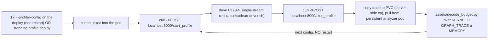

# inference-decode-step-budget

## Purpose

Answer "where does c=1 (low-concurrency) decode time actually go, and what
moves it?" for a live vLLM deploy, **quickly and without the mistakes that
make the answer wrong.** The deliverable is the **decode-step budget**: of the
measured TPOT, how many ms are (a) GPU kernel/graph execution, (b) host-idle
gap (Python scheduler + launch + sampling + spec-decode orchestration), and
(c) comm. From that split the skill classifies the workload as **kernel-bound
/ host-bound / comm-bound** and names the addressable lever - so nobody spends
days tuning a kernel that is 12% of TPOT.

Done naively this measurement is slow and error-prone: repeated vLLM restarts
under nsys, prefill-contaminated captures, and GPU-busy numbers that silently
miss CUDA-graph execution. The fast path + correctness gates below make it a
5-minute, repeatable workflow.

## The fast path (enable once, iterate restart-free)

The deployed vLLM exposes a **profiler HTTP API** gated on `ProfilerConfig`
(`vllm/config/profiler.py` + `vllm/entrypoints/serve/profile/api_router.py`
in the vLLM source tree):

| Endpoint | Effect |
|---|---|
| `POST /start_profile` | begin a profiling window on the running engine |
| `POST /stop_profile` | end the window. Flush the trace to disk |

Two backends, both restart-free **after** a one-time enable:

- `--profiler-config.profiler=cuda` + nsys `--capture-range=cudaProfilerApi
  --capture-range-end=stop --cuda-graph-trace=node` - **the accurate-budget
  default.** vLLM calls `cudaProfilerStart/Stop` on the endpoints. Nsys captures
  the timeline with CUDA-graph kernels resolved and **low overhead**, so the
  absolute GPU-busy% is trustworthy. Needs the nsys sidecar.
- `--profiler-config.profiler=torch` `--profiler-config.torch_profiler_dir=/profiling`
 - kineto trace, **no sidecar**. Use for a **quick SHAPE check only**
  (graphs-in-play? host-gap-dominant? which ops?). **Do NOT trust its absolute
  busy%**: measured on a GLM-5.1 TP=8 NVFP4+graph canary, the torch
  profiler imposed a **~6x decode slowdown** (36 ms/tok vs true 6 ms/tok) and
  inflated kernel durations, so kineto read **~20% GPU-busy vs the nsys-accurate
  12%**. The one robust kineto signal is the **inter-step host gap** (median
  12.35 ms, matched nsys's 11.4 ms) - enough to confirm host-bound, not enough
  for the real budget. Set `torch_profiler_with_stack=false` +
  `warmup_iterations=0` (record-all, bound by a SHORT generation) - stack tracing
  ON + record-all OOM-crashed the engine at gpu-mem-util 0.85.



Per-iteration cost: **seconds**, not the ~5 min a vllm restart costs.

## When to use

- "Where does my c=1 / latency-tier decode time go?" / "Is decode kernel-bound
  or host-bound?" / "Why is TPOT X ms?"
- Before proposing any decode kernel optimization - to confirm the kernel is
  actually on the critical path (it usually is not at c=1).
- A/B of a decode-affecting config (cudagraph mode, spec-decode K, attention
  backend) where you need the per-step budget, not just end-to-end tok/s.

Do **not** use this skill for:

- Per-kernel hardware-counter / roofline detail - that is
  [`inference-kernel-ncu-profile`](/plugins/profile-and-optimize/skills/inference-kernel-ncu-profile/SKILL.md).
- Prefill / throughput-tier (high-concurrency) hot-spots - use
  [`inference-kernel-profile`](/plugins/profile-and-optimize/skills/inference-kernel-profile/SKILL.md) +
  [`analyze-zymtrace-workload`](/plugins/profile-and-optimize/skills/analyze-zymtrace-workload/SKILL.md).
- End-to-end tok/s sweeps - that is [`inference-perf-bench`](/plugins/profile-and-optimize/skills/inference-perf-bench/SKILL.md).

## Example prompts

- "what's the c=1 decode-step budget for glm-inference-latency"
- "is GLM-5.1 decode kernel-bound or host-bound at concurrency 1"
- "profile the decode hot path without restarting the pod"
- "where does the 6ms/token go"
- `/inference-decode-step-budget --deploy glm-inference-latency --concurrency 1`

## Engine gate: vLLM only (SGLang -> nsys fallback)

This skill is **vLLM-specific**: the fast path is vLLM's native HTTP
`/start_profile` + `/stop_profile` (torch-profiler) endpoints. **SGLang serve
pods do not expose `/start_profile`**, so this skill fails closed on an SGLang
arm. For the SGLang decode hot-path, fall back to a per-kernel **nsys timeline**
(launch-wrap `sglang.launch_server` under nsys. Drive a c=1 single-stream window
instead of c=64), then read the GPU-busy-vs-host-gap structure off the nsys CUDA-API trace
(the same where/why question, captured a different way). The engine-agnostic SoL
tiers (zymtrace L1, DCGM L3) apply to SGLang unchanged.

## Prerequisites (fail closed)

1. kubectl write access to the target namespace **and** credentials that will
   not expire mid-run (if access goes through Teleport, run `tsh status` FIRST
   and re-`tsh login` before starting - a mid-run expiry is a known time-sink).
2. The target is a **canary / non-production** deploy, or a confirmed
   maintenance window - enabling the profiler endpoint requires one restart.
3. A writable trace dir mounted in the pod (`/profiling` emptyDir or a PVC) and,
   for cross-restart durability, an RWX PVC the analyzer pod can also mount.
4. For the nsys escalation only: the nsys sidecar image + the pod must NOT
   already have `CUDA_INJECTION64_PATH` set by zymtrace (see the ncu skill's
   "Blocker 1"). Latency canaries typically have no zymtrace injection.

## Interaction style

Iterative. Do one phase, report the single most important number, then ask
before the next. Never dump all diagnostics at once. Mirror
[`k8s-troubleshooting`](/plugins/profile-and-optimize/skills/k8s-troubleshooting/SKILL.md).

## Workflow

### Phase 0: confirm intent + check prior art

State back the deploy, namespace, concurrency, and shape. **Before proposing
any experiment, grep the deploy's prior evidence bundles and summaries** - a
sweep that was already settled (e.g. an MTP `num_speculative_tokens` sweep)
wastes a cycle if re-run. Confirm cluster access is live.

### Phase 1: enable the profiler endpoint (one-time)

Default (on-demand patch, ~5 min restart, then unlimited fast captures):

```bash
# add to the deploy's vllm args:
#   --profiler-config.profiler=torch
#   --profiler-config.torch_profiler_dir=/profiling
# + a /profiling emptyDir|PVC mount, then kubectl apply (Recreate).
```

Standing option (zero setup next time): apply the out-of-Service-selector
`<deploy>-profile` deploy so production routing is untouched. Confirm
`/start_profile` is mounted: `curl -s -o /dev/null -w '%{http_code}'
localhost:8000/start_profile` returns 200 (not 404).

### Phase 2: drive a CLEAN single-stream c=1 workload + capture

Gate 1 (clean driver): tiny prompt + long generation + `ignore_eos`, ONE
request in flight -> pure decode, no prefill, no inter-request gaps.

```bash
kubectl -n $NS exec $POD -c $CTR -- bash -c '
  curl -sS -XPOST localhost:8000/start_profile
  # assets/clean-driver.sh inlined: ~5s of steady c=1 decode
  curl -sS localhost:8000/v1/completions -H "Content-Type: application/json" \
    -d "{\"model\":\"$MODEL\",\"prompt\":\"Count slowly:\",\"max_tokens\":512,\"ignore_eos\":true,\"temperature\":0.0}" -o /dev/null
  curl -sS -XPOST localhost:8000/stop_profile'
```

The torch profiler `active_iterations` / `delay_iterations` schedule
(`ProfilerConfig`) bounds the window so it cannot OOM (Gate 6: keep windows
modest at gpu-mem-util >= 0.85).

### Phase 3: pull the trace + compute the budget

Copy the trace to the PVC **server-side** (`cp /profiling/... /models/...`) to
survive any pod cycle, then analyze from a long-lived analyzer pod (RWX PVC
mount. Keep it alive across iterations). Run:

```bash
python3 assets/decode_budget.py <trace>    # auto-detects nsys .sqlite or kineto .json[.gz]
```

It reports per-device **true GPU-busy = union(KERNEL, GRAPH_TRACE, MEMCPY)**,
the idle-gap histogram, the inter-step cadence, and the per-step
busy-vs-idle-vs-comm split.

### Phase 4: apply the correctness gates, then classify

Run the gates (next section). Only then classify:

- **host-bound** (GPU idle >> busy per step): lever = host path - cudagraph
  coverage, spec-decode host orchestration, graph the sampling/LM-head tail.
  Kernel tuning is futile.
- **kernel/compute-bound** (GPU busy ~= step, one kernel dominates): escalate to
  [`inference-kernel-ncu-profile`](/plugins/profile-and-optimize/skills/inference-kernel-ncu-profile/SKILL.md) on
  that kernel.
- **comm-bound** (all-reduce/all-gather dominates busy): NCCL/NVLS env + TP/topology.

Report the budget table + the verdict + the single highest-leverage lever.

## Correctness gates (the anti-mistake checklist)

These are mandatory. Each one prevents a class of wrong answer seen in practice.

1. **Clean driver.** Single-stream, tiny prompt, long gen, `ignore_eos`. A
   `vllm bench serve --random-input-len 2048` driver mixes prefill + leaves
   inter-request lulls -> the budget is contaminated. Verify the driver round
   ran continuously (no connect errors / 500s) before trusting the trace.
2. **GPU-busy MUST include CUDA-graph execution.** vLLM runs the decode forward
   inside CUDA graphs. Counting only `CUPTI_ACTIVITY_KIND_KERNEL` under-counts
   busy by the graph time (it lands in `GRAPH_TRACE`). Always union
   KERNEL + GRAPH_TRACE + MEMCPY. Detect graphs via the `cudaGraphLaunch` count
   (huge vs `cudaLaunchKernel` -> graphs in play). Use `--cuda-graph-trace=node`
   (nsys) to resolve the kernels inside.
3. **Reconcile against driver-measured TPOT.** Compute tokens/step (MTP emits
   ~accept_len tok/step) and check `step_cadence / tokens_per_step` ==
   benchmark TPOT within ~10%. If it doesn't reconcile, the capture is wrong.
4. **Capture-quality gate.** Reject a trace that has no CUDA-kernel data (caught
   a load-time-only / lull window), shows no repeating decode-step pattern
   (caught a between-request lull), or is truncated (caught a crash mid-window).
   **But first rule out the CUDA image-vs-driver CUPTI skew (Gate 0):** on GB300
   nodes a CUDA 12.9 image vs a 13.0 driver makes CUPTI fail to init
   (`CUPTI_ERROR_INVALID_DEVICE`) -> 0 kernels for ALL CUPTI clients (torch, nsys,
   ncu) regardless of hygiene. Grep the kineto log for `CUDA versions.
   CUPTI/Runtime/Driver` -> a 12.x/13.x split needs a CUDA-13 image or zymtrace,
   not a re-capture.
5. **Prior-art gate.** Grep prior bundles + summaries before
   proposing an experiment. Do not re-run settled sweeps.
6. **Modest window.** Keep the profiler window short (a few seconds /
   `active_iterations` low) - long windows OOM at gpu-mem-util >= 0.85.
7. **Credential pre-flight.** Verify cluster access first (e.g. `tsh status`
   for Teleport). Refresh before starting.

## Assets

- [`assets/clean-driver.sh`](/plugins/profile-and-optimize/skills/inference-decode-step-budget/assets/clean-driver.sh) - workload-agnostic clean
  single-stream decode driver (env: `MODEL`, `PROMPT`, `MAX_TOKENS`,
  `CONCURRENCY`, `ROUNDS`). Reports per-round wall-time so you get TPOT for the
  reconciliation gate for free.
- [`assets/decode_budget.py`](/plugins/profile-and-optimize/skills/inference-decode-step-budget/assets/decode_budget.py) - auto-detects nsys
  `.sqlite` (via `nsys export`) or kineto `.json[.gz]`. Prints the true-busy
  budget, idle-gap histogram, inter-step cadence, and the
  busy-vs-idle-vs-comm per-step split with the capture-quality verdict.

## Worked example (canonical)

GLM-5.1 NVFP4 + MLA + DSA + MTP, TP=8, B200, c=1:
`step ~13.1 ms = ~1.71 ms GPU-busy (12%) + ~11.4 ms host-idle (88%)`, TPOT
6.21 ms/tok (MTP ~2 tok/step) -> **host-bound**. Kernels + graphs are 12% of
TPOT so kernel work cannot move c=1.

## Cost + risk

- One-time ~5 min restart to enable the endpoint (on-demand) or zero (standing
  deploy). Per-capture cost is seconds.
- torch profiler adds modest overhead during the window only. Kineto traces are
  typically 10-200 MB.
- The profiler endpoint is dev-only (vLLM logs a warning) - do not enable on
  production-routed pods. Use a canary or out-of-selector deploy.

## Pairs with

- [`inference-kernel-ncu-profile`](/plugins/profile-and-optimize/skills/inference-kernel-ncu-profile/SKILL.md) - when Phase 4 says kernel-bound, get per-kernel %SoL / occupancy.
- [`inference-kernel-profile`](/plugins/profile-and-optimize/skills/inference-kernel-profile/SKILL.md) - nsys timeline for prefill / throughput tier.
- [`inference-perf-bench`](/plugins/profile-and-optimize/skills/inference-perf-bench/SKILL.md) - the end-to-end TPOT the budget must reconcile against.
- [`evidence-bundle-init`](/plugins/profile-and-optimize/skills/evidence-bundle-init/SKILL.md) - scaffold the bundle first.

## Full-context reporting (no bare numbers)

Per the canon "Every performance number carries its full context (no bare numbers)"
(`docs/METHODOLOGY.md` "Full-context reporting"): every number this
skill emits MUST carry its full measurement-context descriptor, and every comparison MUST be
matched on it. A bare `tok/s` / TPOT / BW / %SoL / speedup is a defect - it cannot set a
default, ship a config, or appear in a report.
- **Identity:** model (+HF path), hardware (exact ceiling token `GB300`/`B200`), quant, kv-cache dtype.
- **Parallelism:** TP, DP (replicas), PP, EP, parallel_strategy.
- **Serving cfg:** max-num-seqs, max-num-batched-tokens, gpu-memory-utilization, max-model-len, cudagraph_mode/enforce_eager, async_scheduling, prefix-caching.
- **Workload:** dataset, ISL/OSL (or mean in/out tokens), concurrency, num-prompts.
- **Regime:** warm vs cold. Latency vs throughput tier.
- **Stack:** image/vllm commit, bench backend, serving engine.
- **Grounding:** `%SoL` (+ ceiling key from `configs/sol-ceilings.yaml` - never inline a peak), sol_rigor (L1-L4), trials n (mean±std), same-node, baseline named.
- **Per-number exact shape (no smoothing):** when reporting more than one number, keep EACH with its own exact shape (ISL/OSL, concurrency, dataset, regime) - never normalize a set to one uniform descriptor that hides per-point variation (e.g. `c=1 @ ISL1024/OSL256` + `c=64 @ ISL4096/OSL512`, NOT one shared "random").

Per `docs/METHODOLOGY.md` "Speed-of-light framing": the decode-step budget IS
the c=1 measured-vs-ceiling artifact. Report GPU-busy% of wall-clock as the
workload-level number. When a kernel-bound verdict sends you to ncu, map the hot
kernel to its ceiling per `configs/sol-ceilings.yaml` (cite by key
path, never inline magic numbers). At c=1 most kernels are launch-latency-scale
(single token) and a throughput-style %SoL under-reads - this is a
**`focus=latency`** run: publish it with `focus=latency` (TPOT/ITL headline) so
it is a first-class, comparable roofline, and let `sol_rigor` (L1/L3/L4) record
how tight the per-category SoL is. Latency-bound is a published result, not an
"ill-posed" reason to withhold the run (always-publish policy).

## Next lever / BREAKTHROUGH (Grind Mandate)

If this skill emits a measured result, its output MUST end by naming the **next perf lever**,
its **expected unlock** (direction + rough magnitude), and the **gate** that proves/refutes it,
per `docs/METHODOLOGY.md` "Always be grinding (next-lever framing)". A
measured win is the new floor, not the finish -- so **do everything we can to find the next
BREAKTHROUGH**: the highest-EV unlock toward Speed-of-Light (a new champion / kernel / router /
quant / parallelism / spec-decode win, or an unblocked stack), not just the next micro-lever.
Rank the candidate breakthrough levers by value x cost (the GRIND FRONTIER, `perftunereport
value_view`), pursue the top, bank the rest with evidence. Record WHY a refuted lever loses,
update the standing frontier in the active bundle's `HANDOFF.md`. Never conclude
"exhausted/optimal/done" without an explicit next-lever frontier (an empty frontier AND a
documented SoL wall only). Delete this section ONLY if the skill produces no measurements.

## Source-of-truth references

- `vllm/config/profiler.py` + `vllm/entrypoints/serve/profile/api_router.py` (vLLM source tree) - the profiler endpoint contract.
- `docs/METHODOLOGY.md` - full-context reporting + Speed-of-light framing.
